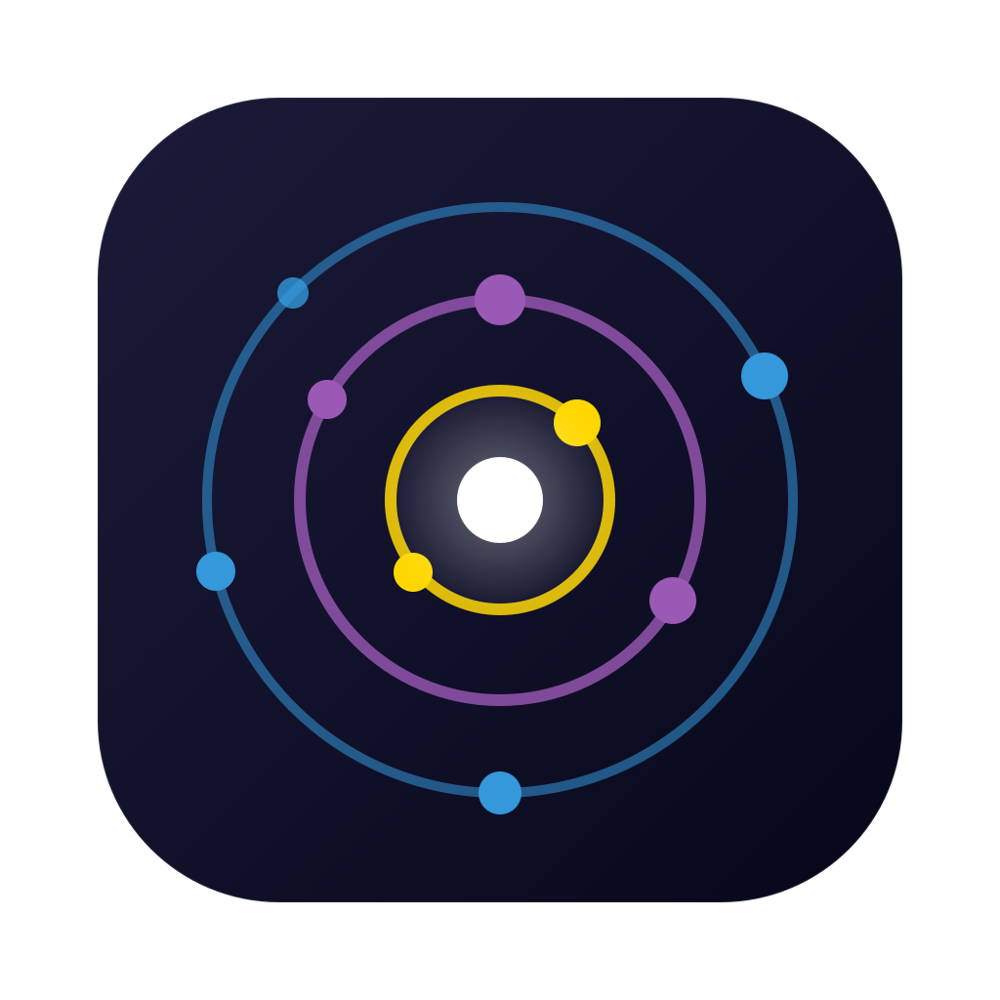
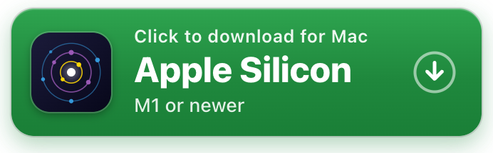
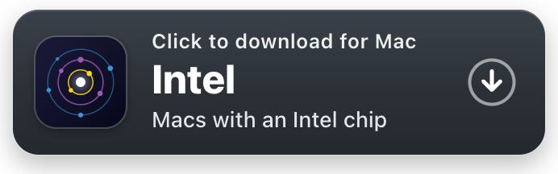
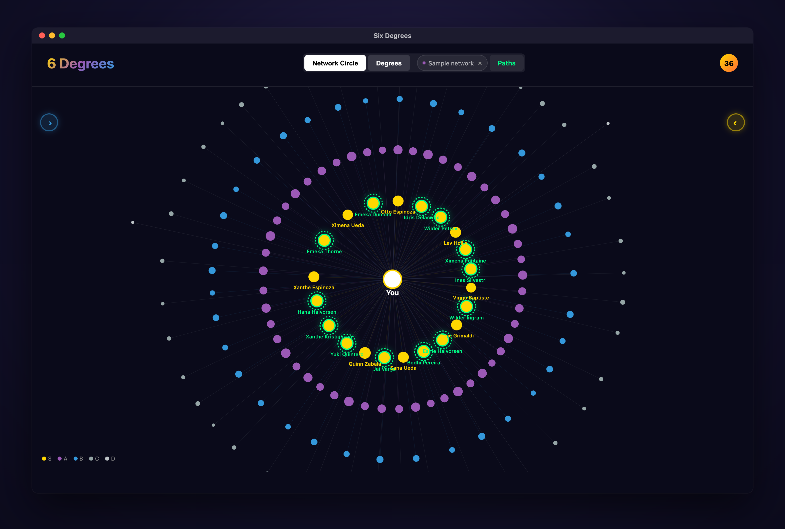
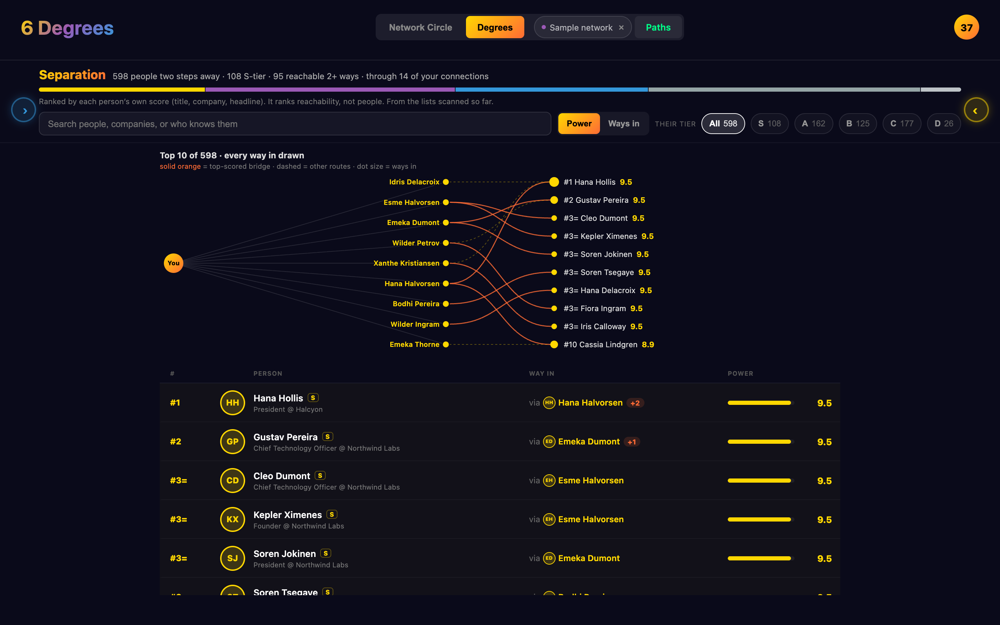

<p align="center">
  <a href="https://blakeb056.github.io/six-degrees/"></a>
</p>

<h1 align="center">Six Degrees</h1>

<p align="center">
  <em>Map your LinkedIn network as a galaxy — see who bridges you to everyone else,<br />
  and find the shortest path to someone you haven't met.</em>
</p>

## Install it

<p align="center"><strong>Click the button for your Mac to download the app.</strong></p>

<p align="center">
  <a href="https://github.com/blakeb056/six-degrees/releases/latest/download/Six-Degrees-Mac-Apple-Silicon.dmg"></a>
  <a href="https://github.com/blakeb056/six-degrees/releases/latest/download/Six-Degrees-Mac-Intel.dmg"></a>
</p>

<p align="center"><sub>Free Mac app · macOS 13.5 or later · <a href="https://blakeb056.github.io/six-degrees/">website</a> · <a href="https://github.com/blakeb056/six-degrees/releases/latest">what's new</a></sub></p>

**Which download?** Apple menu → **About This Mac**. If it says "Chip: Apple M…", take
**Apple Silicon**. If it says "Processor: …Intel…", take **Intel**. It needs **macOS 13.5
(Ventura) or later**, and it's about 185 MB.

**The first time you open it**, macOS stops it, because the app isn't signed with a
paid Apple certificate yet:

1. Open the file you downloaded (**Six-Degrees-Mac-….dmg**, in your Downloads folder).
   In the window that opens, drag **Six Degrees** onto the **Applications** folder.
2. Open **Six Degrees** from Applications. macOS says it can't check the app for
   malware. Close that message with **Done** (on macOS 13 or 14 it may say **OK** or
   **Cancel**). Anything except *Move to Trash*.
3. Open **System Settings → Privacy & Security**, scroll down to *"Six Degrees" was
   blocked*, and click **Open Anyway**. Confirm with **Open Anyway** again (on macOS
   13 or 14 the button says **Open**), and enter your password if asked.

That's once per download; after that it opens like any app.

**Or install it from Terminal** (no approval step). Press ⌘ Space, type *Terminal* and
press Return. Paste this line into the window that opens and press Return:

```bash
curl -fsSL https://raw.githubusercontent.com/blakeb056/six-degrees/main/install.sh | bash
```

It downloads the right version for your Mac, checks the file is exactly the one
published here, puts **Six Degrees** in Applications and opens it.
[Read the script](install.sh) first if you like.

**Updating.** Choose *Six Degrees → Check for Updates…* (or open **Settings** with the ⚙
button or ⌘,). It opens the Updates section and checks. Nothing checks by
itself. If there's a newer version, it gives you the Terminal line to paste, which
replaces the app even while it's running. Downloading the new `.dmg` works too; you'll
repeat step 3 once for it.

Your network isn't stored in the app. It's in a hidden folder in your home folder,
`.six-degrees` (open it any time with *Help → Show the Data Folder*), so updates never
touch it. Each new version also copies your data into its `backups` folder before it
first opens it.

**Linux:** install **Node 22.13 or later** (from nodejs.org or nvm; Ubuntu's own
`nodejs` package is too old), then run:

```bash
npx six-degrees
```

It opens http://127.0.0.1:6363 in your browser (`--no-open` on a machine without a
desktop), keeps your data in `~/.six-degrees` (it prints the folder when it starts;
`--data-dir` puts it elsewhere), and stops with Ctrl-C. To update, stop it and run
`npx six-degrees@latest`; **Settings → Updates** gives the same
line. Scanning LinkedIn also needs Google Chrome (not Chromium) and Python 3.9+ with venv
(on Ubuntu: `sudo apt install python3-venv`). It's tested on Ubuntu, and works on a Mac
too if you'd rather not install the app.

**Windows:** not yet. There's no Windows app, and `npx six-degrees` doesn't run on
Windows yet; npm says so if you try.

<details>
<summary>Run it from source (contributors)</summary>

Needs **Node 22.13 or later** and git.

```bash
git clone https://github.com/blakeb056/six-degrees.git
cd six-degrees
npm ci
npm run build
npm run start:packaged      # opens http://127.0.0.1:6363 in your browser
```

To update later: stop it (Ctrl-C), then
`git pull && npm ci && npm run build && npm run start:packaged`.
Scanning LinkedIn also needs Python 3.9+ and Google Chrome (see below).
</details>

## What it is

<p align="center">
  
</p>

<p align="center"><sub>Every person shown in this README is invented — see <a href="scripts/gen-synthetic.mjs"><code>gen-synthetic.mjs</code></a>.</sub></p>

Your network has a shape, and you can't see it. Six Degrees draws it: everyone you
know placed on rings by how much they can open up for you, the handful of people
whose own circles reach the furthest, and the shortest chain from you to a stranger
worth meeting.

It's a Mac app (or `npx six-degrees` on Linux). It runs on your computer, against your own data, with no account and
no server. (Inside the app the logo reads *6 Degrees*; in Applications it's **Six
Degrees**.)

## Before you scan LinkedIn

> [!WARNING]
> **Scanning drives your own LinkedIn account, and LinkedIn may restrict accounts that
> do this.** Automating LinkedIn may break its User Agreement. It has happened twice
> while building this:
> - The account was temporarily restricted after about 20 profile views in one sitting
>   (2026-09-09); it was lifted the same evening.
> - Search was blocked after results were read too fast (2026-09-24).
>
> The scanner now reads slowly and keeps to a search budget (by default 50 a day and 250
> a month; you can change it on the Scan page). It locks itself during a cooldown, and
> stops at the first sign of push-back. The risk is still yours.
>
> **The CSV import and the sample network carry no LinkedIn risk at all.** Details:
> [how scanning works and what it risks](docs/SCRAPING.md).

## First run

The app opens on a welcome screen with three ways in, and asks nothing about you:

- **Scan my LinkedIn**: a guided page that ticks each step off as it goes. It sets up
  the scanner in one click, you sign into LinkedIn yourself in a Chrome window, and then
  it scans. Needs Google Chrome and Python 3.9+; the page checks that
  both are installed and says what's missing. The app marks this *Recommended* because
  it's the only way to Degrees and Outlink. Read the warning above first.
- **Import my LinkedIn CSV**: LinkedIn's official export, read on your machine. On
  LinkedIn: **Settings & Privacy → Data privacy → Get a copy of your data →
  Connections**. LinkedIn emails a link in about ten minutes; unzip it and drop
  `Connections.csv` into the app.
- **Explore a sample network**: 150 invented connections and the 598 invented people
  they know. Click through before deciding anything.

|  | Your scan | Your `Connections.csv` | Sample network |
|---|---|---|---|
| Setup | Python + Chrome, once | ~10 min (LinkedIn emails the file) | none |
| Network Circle, Paths | ✅ | ✅ | ✅ |
| **Degrees** (people you *haven't* met) | ✅ | — | ✅ |
| **Outlink** (getting introduced) | ✅ | — | — |
| Profile photos | ✅ | initials | initials |
| LinkedIn account risk | **yes**, see above | none | none |

**The CSV is the safe path, and deliberately the shallower one.** LinkedIn's export only
contains people you're already connected to, so Degrees and Outlink, the views about
people you *haven't* met, have nothing to draw. That data exists in no official export;
the scanner is the only way to it, and it's opt-in for that reason.

While the sample or a CSV is loaded, the top bar shows *Sample network ×* or *Your CSV
×* (click × to go back), and Outlink and Scan are hidden. Neither is ever added to your
network: they last as long as the app's window is open.

## What it does

**Network Circle.** Everyone you know, on rings by tier, the most powerful closest to
you. Switch the drawing between **Galaxy**, **Orbit**, **Pyramid** and **List** in the
panel on the left.

**Degrees** *(needs a scan or the sample)*. The people two steps away. **Separation**
ranks every one of them with every way in: which of your connections knows them, and
how many do. **Orbit**, **Bridge Chains**, **Revolver**, **Pyramid** and **List** draw
the same people differently.



**Paths.** Your network by company and industry, in the spirit of LinkedIn's old
InMaps:
- **Map**: your companies as bubbles (the 140 largest), grouped by industry and linked
  where your connections at one know people at another.
- **Industries**: a card per industry.
- **Companies**: pick one to see its people level by level, up to the top.
- **Scores**: every scanned company's score, which you can change.

Click a company for its analyzer: who you know there, who you can reach, the warmest way
in, and its most powerful people.


**Outlink** *(needs a scan)*. Getting introduced, as a game. Each mapped connection's
circle offers its best five people at a time; mark invites as sent to fill the ring and
unlock the next five. It also shows the next best moves, levels and points (from
invites sent and people who accepted, never from browsing).

**Scan.** The guided scanner. It shows progress, the budget that's left, the cooldown
lock, and a **Paused** list you can carry on from.

## How scoring works

```
power = title × (0.45 + 0.055 × company score) + reach bonus + bridge boost
tiers:  S ≥ 7.5   A ≥ 5.5   B ≥ 4.0   C ≥ 2.5   D < 2.5
```

- **Title (1–10)** comes from someone's current role in their headline, with former
  roles at 70%; current students are capped.
- **Company score (1–10)** is the one you set (Paths → Scores) if there is one. Otherwise
  it comes from a built-in list of well-known companies, or from how many of your people
  work there. The built-in list is the same for everyone and follows one rule: only
  companies most US professionals would recognise (household names, the largest companies,
  top investment, consulting, law and accounting firms, frontier AI labs, top universities),
  scored 7 to 10. Anything else is estimated from your network. If you scanned with an
  earlier version, Paths → Scores offers once to keep its old scores for the companies in
  your network whose score changed.
- **Your sector (Settings, optional):** pick up to three sectors you work in, and companies
  in them get +1 ("lean") or +2 ("strong") on that score, once, never above 10 and never on
  a score you set. A pick is one of twelve broad industries or a narrower sector from a
  built-in list of about fifty (Dental, Real Estate, Software & SaaS…). A sector matches by a
  fixed list of words: in the company's name, or in the headlines of at least half of the
  people you know there, where a job every kind of company has (recruiter, accountant,
  software engineer) doesn't count. An industry includes its sectors, and a company's one
  industry when the known list or the company's name gives it, not when only its people's
  job titles do. Settings suggests the sectors your network is in and shows what would
  change before you save.
- Multiplying means seniority counts for more at a bigger company. A VP at a company
  scored 10 gets 9.0; a founder at an unknown company, 6.7.
- **Reach bonus (up to 1.5)**: investor, YC, an audience in the millions. It counts half
  at an unknown company, because headlines are self-written (your sector doesn't change
  that).
- **Bridge boost (up to 1)**: someone whose mapped circle is unusually strong.

Scanned and sample people show the working ("VP / Partner / GM (9) · Snap (8/10) · +0.7
strong circle"). A CSV import shows the score only, and uses the built-in company list
rather than your own scores or sectors; the sample network keeps its own. The model is
[`lib/scoring.js`](lib/scoring.js), explained in
[`docs/brain/SCORING.md`](docs/brain/SCORING.md).

It estimates **network position**, not what anyone is worth as a person.

## Privacy

- Your network is stored on your computer and nowhere else. No account, no server, no
  telemetry, no analytics, no crash reporting.
- A CSV import is read on your machine and never added to your network. It's held only
  in the app window's own storage, and you import it again next time.
- The app contacts only these, and only when you act:
  - **LinkedIn**, while you scan. Also, until a profile photo has been saved to your
    computer, the app shows it straight from LinkedIn's image server.
  - **PyPI** (the Python package library), once, to download the scanner's add-ons.
  - **GitHub**, only when you click *Check for updates*, to read the newest version
    number.
  
  Nothing about you is sent, and nothing checks on its own.
- The web framework's own anonymous usage stats are turned off.

See [SECURITY.md](SECURITY.md) for the threat model.

## How your data is stored

```
.six-degrees/               in your home folder (hidden)
├── six-degrees.sqlite      your network: connections, scores, tiers, queue
├── backups/                a copy of the database before each new version touches it
├── avatars/                profile photos, if you scan
├── chrome-profile/         the scanner's Chrome sign-in, if you scan (see below)
├── venv/                   the scanner's Python add-ons, if you set it up
├── pushback/               what LinkedIn's page said if it ever pushed back
└── *.json                  the scanner's budget, cooldown, progress and skip lists
```

**To remove everything:** quit the app and drag **Six Degrees** from Applications to the
Trash. Then in Finder choose **Go → Go to Folder…** (⇧⌘G), paste `~/.six-degrees` and
move that folder to the Trash. Do the same for
`~/Library/Application Support/Six Degrees`, the app window's own storage and cache
(it can include a CSV you imported).

> [!WARNING]
> `chrome-profile/` holds a **real, signed-in LinkedIn session**. It's the one thing here
> that grants access to your account. Never copy it, sync it or share it. Deleting it
> just means signing in again.

## Configuration (for developers)

Nothing to configure. Two optional environment variables exist:

| Variable | Purpose |
|---|---|
| `SIX_DEGREES_HOME` | Where your data lives. Defaults to `~/.six-degrees`. It's read at launch, so it applies to `npx six-degrees` and source runs (npx also takes `--data-dir`; see `npx six-degrees --help`), not when the Mac app is opened from the Dock or Finder. |
| `ADMIN_TOKEN` | Not needed on your own computer. The app listens only on 127.0.0.1 and isn't built to be exposed: don't put it behind a tunnel or bind it to another address ([SECURITY.md](SECURITY.md)). If it's ever bound elsewhere, the six routes that delete data, run the scanner or update a copy run from source refuse every caller without this token, including the app's own buttons. Everything else, including reading your whole network, stays open. |

## Contributing

See [CONTRIBUTING.md](CONTRIBUTING.md). The rule that matters most: **never commit real
network data**. That means no exported CSVs, no avatars, and no screenshots of real
people.

## License

MIT © Blake Burford — see [LICENSE](LICENSE).
