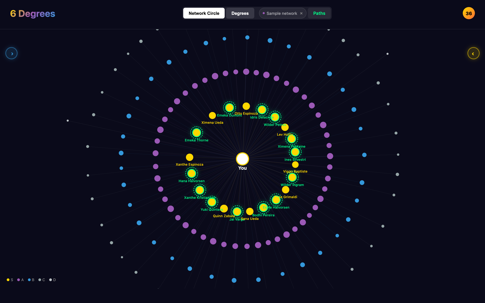
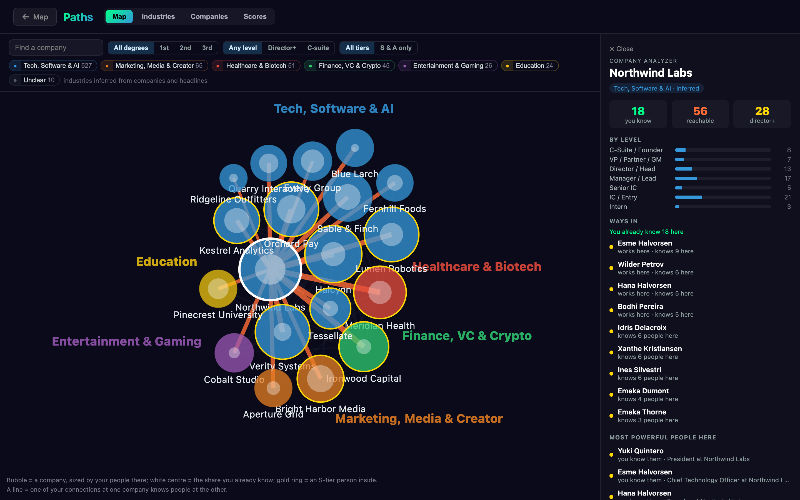
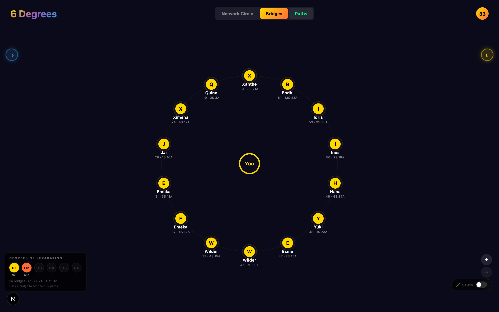

<h1 align="center">6 Degrees</h1>

<p align="center">
  <em>Map your professional network as a galaxy — see who bridges you to everyone else,<br />
  and find the shortest path to someone you haven't met.</em>
</p>

<p align="center">
  <a href="https://github.com/blakeb056/six-degrees/actions/workflows/ci.yml"></a>
  <a href="LICENSE"></a>
  = 22.13">
  
</p>

<p align="center">
  
</p>

<p align="center"><sub>Every person shown in this README is invented — see <a href="scripts/gen-synthetic.mjs"><code>gen-synthetic.mjs</code></a>.</sub></p>

---

Your network has a shape, and you can't see it. 6 Degrees draws it: every
connection placed on a tier ring by estimated career leverage, the handful of
people whose own circles open the most doors, and the shortest chain from you
to a stranger worth meeting.

It runs on your machine, against your own data, with no account and no server.

## Quickstart

```bash
npx six-degrees@latest
```

That is the whole thing. It starts on <http://127.0.0.1:6363>, opens your
browser, and offers a sample network you can explore immediately. `@latest` is
in the command on purpose — npx will otherwise reuse a cached older copy.

### Or download it for macOS

A `.dmg` is on the [releases page](https://github.com/blakeb056/six-degrees/releases).
Drag it to Applications and open it — Node is bundled, so nothing else is required to
import a CSV and explore your network.

**The first launch needs one approval.** The app is not signed with a paid Apple
developer certificate, so macOS refuses it once: open **System Settings → Privacy &
Security**, scroll down, and click **Open Anyway**. Once per machine.

Scanning LinkedIn directly additionally needs Python 3 and Google Chrome; the Scan page
inside the app checks for both and installs the rest itself.

Prefer to read the code first, or want to change it:

```bash
git clone https://github.com/blakeb056/six-degrees
cd six-degrees
npm install
npm run dev
```

Opens on <http://localhost:3000>. **Needs Node 22.13 or newer** — the database is
Node's built-in `node:sqlite`, and `npm run dev` stops with a clear message on
anything older rather than failing later. There is nothing to configure: no
`.env`, no account, no keys.

Either way: choose **Map your own network**, drop in LinkedIn's official
`Connections.csv`, and your galaxy renders — or open **Scan** to pull it straight
from LinkedIn (that path also needs Python 3.9+ and Google Chrome, and the app
installs the Python side for you).

### What each way in gives you

|  | Sample network | Your `Connections.csv` | Local scraper |
|---|---|---|---|
| Setup | none | ~10 min (LinkedIn emails the file) | Python + Chrome, once |
| Galaxy, Tiers, Paths | ✅ | ✅ | ✅ |
| Profile photos | initials | initials | ✅ |
| **Bridges, Outlink** (2nd-degree) | ✅ | — | ✅ |

**The CSV is the supported path and it is deliberately the shallower one.** LinkedIn's export
contains only people you are already connected to, so the two views about people you *haven't*
met — Bridges and Outlink — have nothing to draw. That data exists nowhere in any official
export; the scraper is the only way to it, and it is opt-in for a reason. Explore the sample
network first if you want to see those views before deciding.

No account, no API keys, no database to provision. Your data is written to a
single SQLite file at `~/.six-degrees/six-degrees.sqlite`, and the four
runtime dependencies are `next`, `react`, `react-dom` and `d3` — the database
driver is Node's own built-in `node:sqlite`. Requires **Node 22.13+**.

## Use your own network

### No setup at all: the sample network

Launch the app and choose **Explore a sample network** — 150 invented people with
mapped bridge circles, enough to click through every view before you decide
whether to import anything of your own. Regenerate it any time with
`npm run gen:demo`.

### The safe path: LinkedIn's official export

1. LinkedIn → **Settings & Privacy → Data privacy → Get a copy of your data**
2. Select **Connections** and request the archive
3. LinkedIn emails a download link, usually within ~10 minutes
4. Unzip it and drop `Connections.csv` into the app's **Import** page

The file is parsed **in your browser**. Nothing is uploaded, nothing is stored,
and the `Email Address` column is never read. Close the tab and it's gone.

Two honest limits of the official export: it contains **no profile photos**, so
people render as initials on a tier-colored circle; and it covers only people
you are *already* connected to, so the Bridges and Outlink views stay empty —
those map the people you haven't met yet.

### The deeper path: the local scraper

This is the only way to get **2nd-degree** data — who your connections know.
LinkedIn's export cannot provide it, so Bridges and Outlink stay empty without it.

**You do not need a terminal for this.** Start the app, open **Scan** in the nav,
and use the buttons:

1. **Install what the scraper needs** — one click. It builds a private Python
   environment inside your data directory and installs into that, so it never
   touches the Python your system or Homebrew put there.
2. **Sign into LinkedIn** — a Chrome window opens and waits for you, with no time
   limit. Close the window to cancel. Once per machine.
3. **1st degree** — the people you know. The whole list on the first run, about a
   minute and a half for 750 people; only what is new after that.
4. **2nd degree** — the people *they* know. This is what fills **Bridges** and
   **Outlink**. It opens each connection in turn, so it is slow by design and runs
   in batches of 10, 25 or 50 with a **Stop** button. Most people hide their
   connections; those are noted and never retried.

The live log is on the page throughout.

**Go easy on the 2nd-degree step.** LinkedIn restricts accounts that view a lot of
profiles in a short time — this happened during development after about an hour of
continuous mapping, roughly 20–25 profiles. Run a batch, leave it a while, run
another. If LinkedIn warns you about unusual activity, press Stop and leave it for
the day.

Sign in with your **email and password**. "Continue with Google" and "Sign in with
Apple" cannot work here: Google blocks its sign-in flow inside automated browsers,
so that window opens greyed out and never finishes. If your account only has a
Google login, set a LinkedIn password first.

Needs Python 3.9+ and Google Chrome. The scraper drives your real Chrome, so
there is no extra browser to download.

<details>
<summary>Prefer the command line?</summary>

The scraper writes into the running app, so the app has to be up. Start it in one
window with `npm run dev`, then in a second window:

```bash
npm run setup:python                            # once per machine
python3 scripts/scrape.py --login               # sign in, then exit
npm run scrape                                  # full the first time, new-only after
npm run scrape:full                             # walk the whole list again
python3 scripts/scrape.py --bridge "Jane Doe"   # one person's 2nd-degree circle
python3 scripts/scrape.py --company "Acme"      # everyone visible at one company
```

If `pip` refuses with `externally-managed-environment`, that is your system Python
protecting itself (PEP 668). Use the Scan page instead — it makes a virtual
environment for you — or make one yourself.

Full detail: [`docs/SCRAPING.md`](docs/SCRAPING.md).

</details>

## What it does

**Galaxy** — a force-directed map of your whole network, each person placed on a tier ring and sized by power score.


**Bridges** *(needs 2nd-degree data — scraper or sample only)* — your highest-leverage 1st-degree people on a ring. Each one shows the size and quality of the circle behind them; select one to fan that circle out. This is the view that answers *who can introduce me to people I don't know yet*.

**Paths** — company intelligence. Who you already know at each company, who is still out of reach, and how much of your foothold is senior.



**Outlink** *(needs 2nd-degree data — scraper or sample only)* — a ranked outreach queue built from 2nd-degree recommendations.



**Tiers** — everyone scored S/A/B/C/D from role seniority and company prestige.

## How scoring works

```
power score = (seniority × 0.5) + (company prestige × 0.3) + signals + recency
tiers:  S ≥ 7.0   A ≥ 5.5   B ≥ 4.0   C ≥ 2.5   D < 2.5
```

Seniority is inferred from job title, prestige from a configurable company list,
signals from headline keywords, and recency gives a small bonus to connections
made in the last 30 days. The reference implementation is
[`scripts/score_new_connections.sql`](scripts/score_new_connections.sql), and
[`lib/rpc.js`](lib/rpc.js) is a direct transcription of it — that is what scores
anything the scraper brings in.

**CSV imports score on a reduced model.** LinkedIn's export has a bare job title
and no headline, so the headline-signal and recency terms simply cannot be
computed; those rows are scored from role and company alone
([`lib/csv.js`](lib/csv.js)). The same person can land a tier apart depending on
which path they arrived through. The two never mix in one view.

It estimates **network reach**, not human worth. Keep that framing.

## Privacy

- A CSV import never leaves your browser and is never persisted
- Scraped data and avatars are written locally and are gitignored
- No telemetry, no analytics, no crash reporting from this app
- The only outbound requests **it** makes are to LinkedIn, and only while you
  are scraping
- Next.js collects anonymous build metrics of its own; the `dev`, `build` and
  `start` scripts set `NEXT_TELEMETRY_DISABLED=1`, so it stays off here. `npm
  install` talks to the npm registry, as it does for any project.

See [SECURITY.md](SECURITY.md) for the threat model.

## Configuration

There is nothing to configure. Two optional environment variables exist:

| Variable | Purpose |
|---|---|
| `SIX_DEGREES_HOME` | Where the database and avatars live. Defaults to `~/.six-degrees`. |
| `ADMIN_TOKEN` | Only needed if you expose the app beyond localhost. The four destructive routes are open on your own machine and require this bearer token from any other host. |

## How your data is stored

```
~/.six-degrees/
├── six-degrees.sqlite      your network — connections, scores, tiers, queue
├── six-degrees.sqlite-wal  SQLite write-ahead log (and -shm alongside it)
├── avatars/                profile photos, if you run the scraper
└── chrome-profile/         only if you run the scraper — see the warning below
```

To remove everything this app created, delete that folder. The app also keeps
your name and a local id in the browser's `localStorage`; clearing site data for
`localhost` removes it.

> [!WARNING]
> `chrome-profile/` holds a **real logged-in LinkedIn session**. It is created
> only when you run the scraper, is typically several hundred megabytes, and is
> the one thing here that grants access to your account. Never copy it, sync it,
> or commit it. Deleting it simply means logging in again next time.

## Contributing

See [CONTRIBUTING.md](CONTRIBUTING.md). The one rule that matters: **never
commit real network data** — no exported CSVs, no avatars, no screenshots of
real people. CI fails the build if they appear.

## License

MIT © Blake Burford — see [LICENSE](LICENSE).
