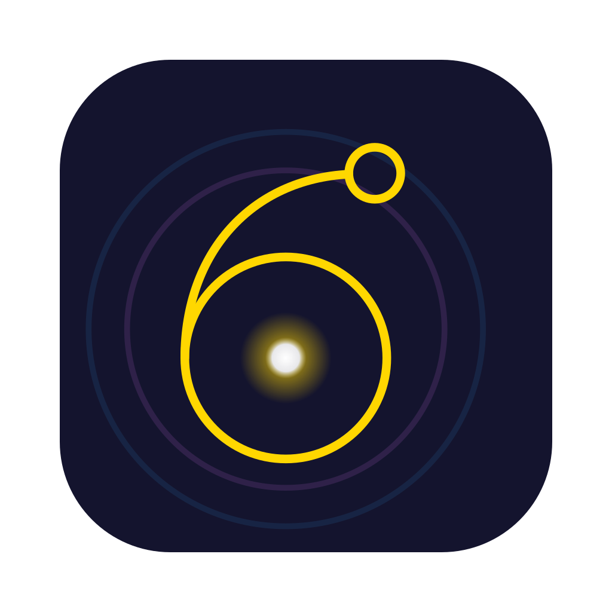
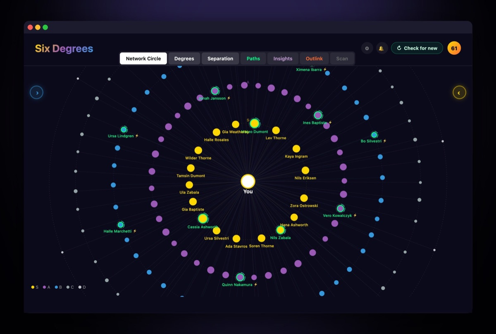
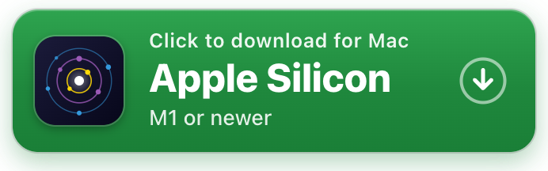
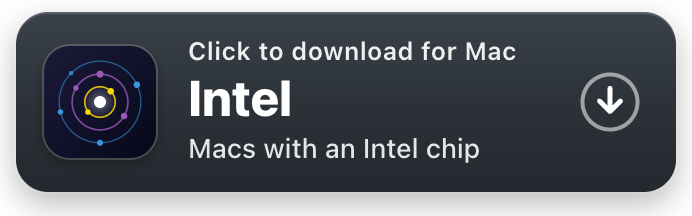
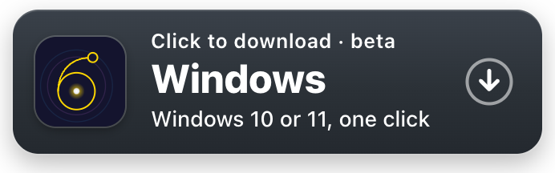
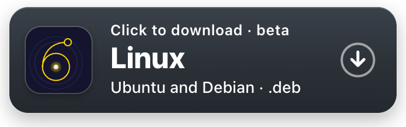
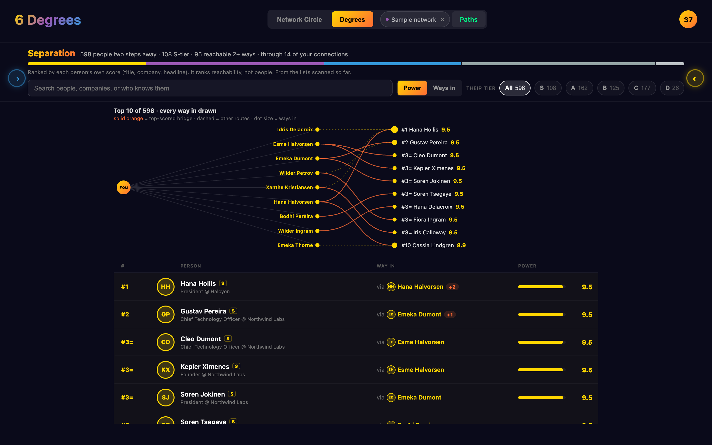
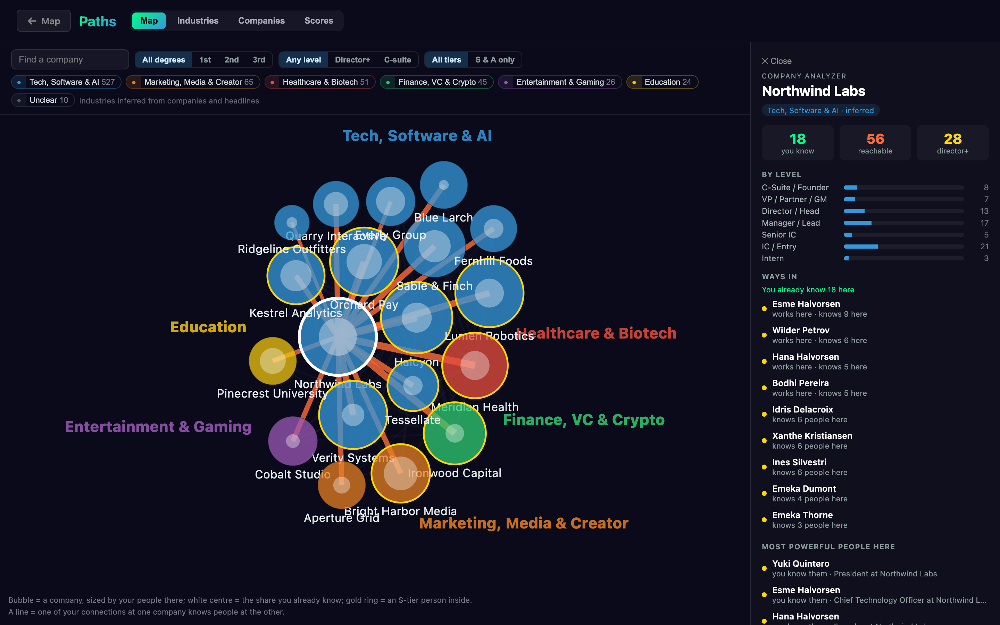

<p align="center">
  <a href="https://sixdegreesapp.com/"></a>
</p>

<h1 align="center">Six Degrees</h1>

<p align="center">
  <strong>See your LinkedIn network as a galaxy.</strong><br>
  Who can introduce you, who only one of your connections can reach, and the shortest path to<br>
  someone you haven't met. Free, open source, and it runs on your own computer.
</p>

<p align="center">
  <strong>1.0:</strong> complete, signed and notarized by Apple, and maintained. New features come slowly.
</p>

<p align="center">
  <a href="https://github.com/blakeb056/six-degrees/releases/latest"></a>
  <a href="https://github.com/blakeb056/six-degrees/releases/latest"></a>
  <a href="LICENSE"></a>
  <a href="https://www.npmjs.com/package/six-degrees"></a>
  <a href="https://github.com/blakeb056/six-degrees/actions/workflows/ci.yml"></a>
</p>

<p align="center">
  <a href="https://sixdegreesapp.com/"><strong>Website</strong></a> ·
  <a href="#download">Download</a> ·
  <a href="#features">Features</a> ·
  <a href="#latest-news">News</a> ·
  <a href="#why-six-degrees">Why Six Degrees</a> ·
  <a href="#docs">Docs</a> ·
  <a href="https://sixdegreesapp.com/blog/">Blog</a> ·
  <a href="https://sixdegreesapp.com/roadmap/">Roadmap</a> ·
  <a href="#contributing">Contributing</a>
</p>

<p align="center">
  <a href="https://sixdegreesapp.com/"></a>
</p>

<p align="center"><sub>Every person shown in this README is invented — see <a href="scripts/gen-synthetic.mjs"><code>gen-synthetic.mjs</code></a>.</sub></p>

Your network has a shape, and you can't see it. Six Degrees draws it: everyone you
know placed on rings by how much they can open up for you, the handful of people
whose own circles reach the furthest, and the shortest chain from you to a stranger
worth meeting.

It's a Mac app, and now a Windows and Linux app too (beta). It runs on your computer, against your own data, with no account and
no server.

## Download

<p align="center">
  <a href="https://github.com/blakeb056/six-degrees/releases/latest/download/Six-Degrees-Mac-Apple-Silicon.dmg"></a>
  <a href="https://github.com/blakeb056/six-degrees/releases/latest/download/Six-Degrees-Mac-Intel.dmg"></a><br>
  <a href="https://github.com/blakeb056/six-degrees/releases/download/v0.5.1-beta.1/Six-Degrees-Windows-Setup.exe"></a>
  <a href="https://github.com/blakeb056/six-degrees/releases/download/v0.5.1-beta.1/Six-Degrees-Linux-x64.deb"></a>
</p>

| Platform | Download | Needs |
|---|---|---|
| **macOS**, Apple Silicon (M1 or newer) | [Six-Degrees-Mac-Apple-Silicon.dmg](https://github.com/blakeb056/six-degrees/releases/latest/download/Six-Degrees-Mac-Apple-Silicon.dmg) | macOS 13.5 (Ventura) or later |
| **macOS**, Intel | [Six-Degrees-Mac-Intel.dmg](https://github.com/blakeb056/six-degrees/releases/latest/download/Six-Degrees-Mac-Intel.dmg) | macOS 13.5 (Ventura) or later |
| **Windows** (beta) | [Six-Degrees-Windows-Setup.exe](https://github.com/blakeb056/six-degrees/releases/download/v0.5.1-beta.1/Six-Degrees-Windows-Setup.exe) | Windows 10 or 11, 64-bit |
| **Linux** (beta) | [Six-Degrees-Linux-x64.deb](https://github.com/blakeb056/six-degrees/releases/download/v0.5.1-beta.1/Six-Degrees-Linux-x64.deb) or [.tar.gz](https://github.com/blakeb056/six-degrees/releases/download/v0.5.1-beta.1/Six-Degrees-Linux-x64.tar.gz), or from the Terminal: `npx six-degrees` ([how](https://sixdegreesapp.com/download/#linux)) | Ubuntu or Debian, 64-bit (npx: Node 22.13 or later) |

<sub>Every release is on [GitHub Releases](https://github.com/blakeb056/six-degrees/releases) with a
`SHA256SUMS` file ([latest](https://github.com/blakeb056/six-degrees/releases/latest/download/SHA256SUMS)); the Terminal install below checks the download against it.
The links above always fetch the newest release.</sub>

## Install it

**Which download?** Apple menu → **About This Mac**. If it says "Chip: Apple M…", take
**Apple Silicon**. If it says "Processor: …Intel…", take **Intel**. It needs **macOS 13.5
(Ventura) or later**, and it's about 210 MB. Everything the scanner needs except Google
Chrome is inside, Python included, so there's nothing else to install.

1. Open the file you downloaded (**Six-Degrees-Mac-….dmg**, in your Downloads folder).
   In the window that opens, drag **Six Degrees** onto the **Applications** folder.
2. Open **Six Degrees** from Applications. Signed by Blake Burford and notarized by
   Apple: it opens like any Mac app. The first time, macOS asks whether to open an app
   downloaded from the internet: click **Open**.

(A copy of 0.8.0 or earlier wasn't signed yet: if macOS says it can't check it for
malware, close that message, not *Move to Trash*, then **System Settings → Privacy &
Security → Open Anyway**. Or update it, below.)

**Or install it from Terminal.** Press ⌘ Space, type *Terminal* and
press Return. Paste this line into the window that opens and press Return:

```bash
curl -fsSL https://raw.githubusercontent.com/blakeb056/six-degrees/main/install.sh | bash
```

It downloads the right version for your Mac, checks the file is exactly the one
published here, puts **Six Degrees** in Applications and opens it.
[Read the script](install.sh) first if you like.

**Updating.** Choose *Six Degrees → Check for Updates…* (or open **Settings** with the ⚙
button or ⌘,). It opens the Updates section and checks. Nothing checks by
itself. If there's a newer version, click **Install and restart**: the app downloads it
from GitHub, checks it against the release's published checksums and checks that its code
signature is intact, closes, puts the new version in its place and opens it again. If the
new version can't be put in place, won't open, or closes before its first page appears,
your old one is put back and opened. Once the new one has started, the version you had is
kept, zipped, in `~/Library/Caches/Six Degrees` until the next update: if the new one
misbehaves later, unzip it and drag the app into Applications to go back. When the app
can't update itself (for example, it's running from the disk image), it says why and what
to do, usually with a Terminal line to paste and what that line will do. Copies of 0.2.1
and older don't have the button yet, so they take the Terminal line once more.
Downloading the new `.dmg` and dragging it to Applications works too.

Your network isn't stored in the app. It's in a hidden folder in your home folder,
`.six-degrees` (open it any time with *Help → Show the Data Folder*), so updates never
touch it. Each new version also backs up your data, photos and all, into its `backups`
folder before it first opens it, and Six Degrees makes a backup each day it's open
(see [Backups](#backups)). To take it to another computer, see
[Moving to a new computer](#moving-to-a-new-computer).

**Windows (beta):** download [Six-Degrees-Windows-Setup.exe](https://github.com/blakeb056/six-degrees/releases/download/v0.5.1-beta.1/Six-Degrees-Windows-Setup.exe)
and open it. It installs for you alone (no administrator password), adds Start Menu and
Desktop shortcuts, and opens Six Degrees. It isn't signed with a paid certificate yet, so
SmartScreen may say it protected your PC: **More info → Run anyway**. A newer Setup.exe
updates it in place; your network stays in `%USERPROFILE%\.six-degrees`, which
uninstalling never touches. Scanning needs Google Chrome.

**Linux app (beta):** `sudo apt install ./Six-Degrees-Linux-x64.deb` with the
[.deb](https://github.com/blakeb056/six-degrees/releases/download/v0.5.1-beta.1/Six-Degrees-Linux-x64.deb), then open it from your apps. The
[.tar.gz](https://github.com/blakeb056/six-degrees/releases/download/v0.5.1-beta.1/Six-Degrees-Linux-x64.tar.gz) runs from its folder; on Ubuntu 24.04 and
later run `sudo chown root:root chrome-sandbox && sudo chmod 4755 chrome-sandbox` in it
once (or start it with `--no-sandbox`). Scanning needs Google Chrome (not Chromium).

**Linux from the Terminal:** install **Node 22.13 or later** (from nodejs.org or nvm; Ubuntu's own
`nodejs` package is too old), then run:

```bash
npx six-degrees
```

It opens http://127.0.0.1:6363 in your browser (`--no-open` on a machine without a
desktop), keeps your data in `~/.six-degrees` (it prints the folder when it starts;
`--data-dir` puts it elsewhere), and stops with Ctrl-C. To update, stop it and run
`npx six-degrees@latest`; **Settings → Updates** gives the same
line. Scanning LinkedIn also needs Google Chrome (not Chromium), and Python: your own 3.10
to 3.14 if you have it (on Ubuntu with `python3-venv`), or, if not, the Scan page's **Set
up the scanner** button downloads a private copy into your data folder (24–33 MB, from
GitHub, checked against a checksum built into Six Degrees). It's tested on Ubuntu, and
works on a Mac too if you'd rather not install the app.

`npx six-degrees` doesn't run on Windows; use the Windows app above.

<details>
<summary>Run it from source (contributors)</summary>

Needs **Node 22.13 or later** and git.

```bash
git clone https://github.com/blakeb056/six-degrees.git
cd six-degrees
npm ci
npm run build
npm run start:packaged      # opens http://127.0.0.1:6363 in your browser
```

To update later: stop it (Ctrl-C), then
`git pull && npm ci && npm run build && npm run start:packaged`.
Scanning LinkedIn also needs Google Chrome, and Python 3.10 to 3.14 or the Scan page's
**Set up the scanner** (see below).
</details>

## Features

**Network Circle.** Everyone you know, on rings by tier, the most powerful closest to
you. Switch the drawing between **Galaxy**, **Pyramid** and **List** in the panel on
the left.

**Degrees** *(needs a scan or the sample)*. The people two steps away. **Separation**
ranks every one of them with every way in: which of your connections knows them, and
how many do. **Orbit**, **Bridge Chains**, **Pyramid** and **List** draw the same people
differently.



**Paths.** Your network by company and industry, in the spirit of LinkedIn's old
InMaps:
- **Map**: your companies as bubbles (the 140 largest), grouped by industry and linked
  where your connections at one know people at another.
- **Industries**: a card per industry.
- **Companies**: pick one to see its people level by level, up to the top.

Click a company for its analyzer: who you know there, who you can reach, the warmest way
in, and its most powerful people.



**Insights**, in your profile (the round level button at the top right). Everyone within
two steps of you in one table, ranked by power, each person once: the **Power Index**,
with filters for degree, tier and rarity, and Open circle, Scan circle or Ask on every
row. Beside it, and each a board of its own in the notch: **Kingmakers** (your connections
with the most S and A people behind them), **Gatekeepers** (who your S and A reach hangs
on), **Hidden giants** (S-tier with one way in), **Untapped** (S and A with no request
out), **Company power** and **Industries**. **Report** is the same numbers as a page you
scroll, and **Health** how your network holds together. Every number says where it came
from, and nothing is about money: *Richest?* says plainly that the app never sees it.
Power ranks reachability, not people.

**Scores.** How a power score is worked out, and the three things you can change about
it, in one place: your field (the sectors you work in), how tiers are graded (on your
network's curve or the fixed scale), and every scanned company's score.

**Outlink** *(needs a scan)*. Getting introduced, as a game. Each mapped connection's
circle offers its best five people at a time; mark invites as sent to fill the ring and
unlock the next five. It also shows the next best moves, levels and points (from
invites sent and people who accepted, never from browsing).

**Auto** *(needs a scan)*. Next to every Connect (a person's card, Outlink), Auto sends
that one person a connection request for you, from the scanner's Chrome, without a note.
One press, one person: never a batch, never on a timer. It asks once before the first one.
If LinkedIn wants their email address first, Auto closes that and sends nothing (use
Connect to add them yourself); if it offers a personal note (Premium), Auto sends without
one. It calls a request sent only once their profile shows it pending. It stops at 15 in
any 24 hours and 80 in any 7 days, opens their profile once (a profile view), and counts in
Settings → LinkedIn usage.

**Scan.** The guided scanner. It shows progress, the budget that's left, the cooldown
lock, and a **Paused** list you can carry on from.

**Also in the app:**
- **Who only one connection reaches.** For every connection whose circle you've scanned,
  the people none of your other connections reach: in Bridge Chains, and in the
  *Insights* on their card, with *Show them* to list exactly who.
- **Network health** (Scores). How much of your 2nd degree you reach two or more ways,
  your effective reach, and the five connections who reach the most people no one else
  does. Only your own numbers, never a percentile against other people.
- **A physics lab for the Galaxy** (experimental, in Filters). Sliders for gravity, rings,
  push, pull and distance; colour by tier, degree, company or warmth; find anyone; and a
  **replay** of your network growing by the date you connected, saved as a picture or a
  video.
- **Social** (experimental). From your own LinkedIn data: who's warm, dormant or waiting
  on a reply, and your career chapters. Message text is never kept.

## Latest news

<p>
  <a href="https://github.com/blakeb056/six-degrees/releases/latest"></a>
  <a href="https://github.com/blakeb056/six-degrees/releases/latest"></a>
</p>

Six Degrees ships often, and every release says what it added, changed and fixed:

- **[Releases](https://github.com/blakeb056/six-degrees/releases)**: each version's
  downloads and notes ([Atom feed](https://github.com/blakeb056/six-degrees/releases.atom)).
- **[CHANGELOG.md](CHANGELOG.md)**: everything, newest first, including what's
  coming in the next release.
- **[Release notes on the website](https://sixdegreesapp.com/releases/)**: every version,
  built from the changelog each time the site is published, with a
  [feed](https://sixdegreesapp.com/releases/feed.xml).
- **[The blog](https://sixdegreesapp.com/blog/)**: how it works, and why.

## Why Six Degrees

A connections list tells you who you know. Six Degrees shows what that network can do:

- **Who can introduce you, ranked.** Everyone two steps away, each with every way in.
- **Who only one connection reaches.** Where a single person is your only door.
- **Your network's health.** How much of it you reach more than one way.
- **A physics lab and a replay.** Tune the Galaxy's layout, and watch your network grow.
- **All on your own computer.** No account, no server, no telemetry.

In the sample network that ships with the app (150 invented connections), 598 people are
two steps away, and 503 of them, 84%, are reached through only one connection.

**How it compares**, as fairly as we can put it
([the full table](https://sixdegreesapp.com/#compare)):

| | Six Degrees | LinkedIn's own search | Spreadsheets and CRMs | Network tools (SocNetV, Gephi) |
|---|---|---|---|---|
| Your connections, from LinkedIn's export | ✓ | ✓ | ✓ | as nodes, with no ties |
| Everyone two steps away, with who can introduce you | ✓ (needs a scan, or the sample) | 2nd-degree search, mutual connections on each | — (the export is 1st degree only) | if you bring the ties |
| Who only one connection reaches | ✓ | not shown | — | brokerage measures, on your data |
| A score per person, with the working shown | ✓ | not shown | your own formulas | general centrality |
| A layout you can tune, and a replay by date | ✓ (experimental) | — | — | ✓ many layouts; Gephi's timeline |
| Any network, any data, research-grade statistics | — (LinkedIn networks only) | — | any data | ✓ what they're built for |
| Runs on your computer, with no account | ✓ | — (online, with your account) | varies | ✓ |
| Price | free, MIT | free, with paid plans | free to paid | free, open source |
| Windows | ✓ (beta) | ✓ | ✓ | ✓ |

Something out of date, or unfair to another tool? [Open an issue](https://github.com/blakeb056/six-degrees/issues).

## Before you scan LinkedIn

> [!WARNING]
> **Scanning drives your own LinkedIn account, and LinkedIn may restrict accounts that
> do this.** Automating LinkedIn may break its User Agreement. It has happened twice
> while building this:
> - The account was temporarily restricted after about 20 profile views in one sitting
>   (2026-09-09); it was lifted the same evening.
> - Search was blocked after results were read too fast (2026-09-24).
>
> The scanner now reads slowly and keeps to a search budget (by default 50 a day and 250
> a month) and a cap on profile views (50 a day, at least a minute apart). You can change
> both on the Scan page. It locks itself during a cooldown, and stops at the first sign of
> push-back. The risk is still yours.
>
> **The CSV import and the sample network carry no LinkedIn risk at all.** Details:
> [how scanning works and what it risks](docs/SCRAPING.md).
>
> The app asks for an explicit "I understand" once, before the first scan.
>
> **The scanner reads; the one thing it ever sends is a connection request, and only when
> you press Auto** on a person (one each press, without a note, at most 15 a day and 80 a
> week). Auto asks once before its first request.
>
> Six Degrees is not affiliated with or endorsed by LinkedIn.

## First run

The app opens on a welcome screen with three ways in, and asks nothing about you:

- **Scan my LinkedIn**: a guided page that ticks each step off as it goes. It first asks
  one optional question, what field you're in (see *Your sector* below), and *Skip for
  now* is fine. Then it sets up the scanner in one click, you sign into LinkedIn yourself
  in a Chrome window, and then it scans. Needs Google Chrome. The Mac app brings its own
  Python; with `npx six-degrees` the page uses yours, or sets up a private one with a
  click. It checks and says what's missing. The app marks this *Recommended* because
  it's the only way to Degrees and Outlink. Read the warning above first. On a Mac,
  macOS may ask whether Six Degrees can manage apps while you scan: that's Chrome
  updating itself, and scanning works either way (step 1 has a button to allow it once).
- **Import my LinkedIn CSV**: LinkedIn's official export, read on your machine. On
  LinkedIn: **Settings & Privacy → Data privacy → Get a copy of your data →
  Connections**. LinkedIn emails a link in about ten minutes; unzip it and drop
  `Connections.csv` into the app. It's kept on your computer until you remove it.
- **Explore a sample network**: 150 invented connections and the 598 invented people
  they know. Click through before deciding anything.

|  | Your scan | Your `Connections.csv` | Sample network |
|---|---|---|---|
| Setup | Chrome (Python comes with the Mac app) | ~10 min (LinkedIn emails the file) | none |
| Network Circle, Paths | ✅ | ✅ | ✅ |
| **Degrees** (people you *haven't* met) | ✅ | — | ✅ |
| **Outlink** (getting introduced) | ✅ | — | — |
| Profile photos | ✅ | initials | initials |
| LinkedIn account risk | **yes**, see above | none | none |

**The CSV is the safe path, and deliberately the shallower one.** LinkedIn's export only
contains people you're already connected to, so Degrees and Outlink, the views about
people you *haven't* met, have nothing to draw. That data exists in no official export;
the scanner is the only way to it, and it's opt-in for that reason.

While the sample or a CSV is loaded, the top bar shows *Sample network ×* or *Your CSV
×*, and Outlink and Scan are hidden. Neither is ever added to your network. The sample
lasts as long as the app's window is open. A CSV import is kept on your computer, in the
data folder (`csv-network.json`), so it's still there after you close the window or
restart; click × to remove it (your `Connections.csv` itself isn't touched). Once you've
scanned your own connections, the map shows your scan instead; the CSV stays kept until
you remove it from the import page.

## How scoring works

```
power = title × (0.45 + 0.055 × company score) + reach bonus + bridge boost
tiers, on your network's curve (the default):  your top 3% S, then A to 15%, B to 40%, C to 70%
tiers, on the fixed scale:                     S ≥ 7.5   A ≥ 5.5   B ≥ 4.0   C ≥ 2.5   D < 2.5
```

- **Title (1–10)** comes from someone's roles in their headline, with former roles at
  70%; current students are capped. Academics have their own ladder (an assistant
  professor 5 up to a dean 9), and so do government and the services (a city
  councilmember or a colonel 7.5 up to a senator or a four-star general 10), read only
  where a title is written. An audience of their own counts like a title (100K+
  followers 6.5, 1M+ 7.5, 10M+ 9), and a title it can't read counts as an individual
  contributor's (4).
- **Company score (1–10)** is the one you set (the Scores tab) if there is one. Otherwise
  it comes from a built-in list of well-known companies, or from how many of your people
  work there. The built-in list is the same for everyone and follows one rule: only
  companies most US professionals would recognise (household names, the largest companies,
  top investment, consulting, law and accounting firms, frontier AI labs, top universities),
  scored 7 to 10. Anything else is estimated from your network: a company it doesn't
  know counts as 5, the middle of the scale, a little more when several of your people
  work there. If you scanned with an
  earlier version, the Scores tab offers once to keep its old scores for the companies in
  your network whose score changed.
- **Your sector (Scores, optional):** pick up to three sectors you work in, and companies
  in them get +1 ("lean") or +2 ("strong") on that score, once, never above 10 and never on
  a score you set. A pick is one of twelve broad industries or a narrower sector from a
  built-in list of about fifty (Dental, Real Estate, Software & SaaS…). A sector matches by a
  fixed list of words: in the company's name, or in the headlines of at least half of the
  people you know there, where a job every kind of company has (recruiter, accountant,
  software engineer) doesn't count. An industry includes its sectors, and a company's one
  industry when the known list or the company's name gives it, not when only its people's
  job titles do. Scores suggests the sectors your network is in and shows what would
  change before you save. The Scan page asks for it once, before your first scan, so your
  first scores already use it; you can skip it and pick later.
- Multiplying means seniority counts for more at a bigger company. A VP at a company
  scored 10 gets 9.0; a founder at an unknown company, 7.3.
- **Reach bonus (up to 1.5)**: investor, YC, an audience in the millions, the top award
  of any field (a Nobel, a Pulitzer, an Oscar, an Olympic medal…). It counts half
  at an unknown company, because headlines are self-written (your sector doesn't change
  that).
- **Bridge boost (up to 2)**: someone whose mapped circle is unusually strong: a high
  share of it at A or S (up to +1), or many people there (+1 for every 25, up to +2).
- **Tiers (Scores):** graded on your own network's curve by default, so any network has a
  top: your top 3% of connections are S, the next 12% A, the next 25% B and the next 30% C.
  The curve only lifts, so a network full of well-known companies keeps its tiers, and it
  never lifts anyone under 4 into S or A. People tied at a line all come in or all stay out.
  Choose the fixed scale instead for the same lines as everyone else.

Scanned and sample people show the working ("VP / Partner / GM (9) · Adobe (8/10) · +0.7
strong circle"). A CSV import shows the score only, and uses the built-in company list
rather than your own scores or sectors, graded on its own curve; the sample network keeps its own. The model is
[`lib/scoring.js`](lib/scoring.js), explained in
[`docs/brain/SCORING.md`](docs/brain/SCORING.md).

It estimates **network position**, not what anyone is worth as a person.

## Privacy

- Your network is stored on your computer and nowhere else. No account, no server, no
  telemetry, no analytics, no crash reporting.
- A CSV import is read on your machine and never added to your network. It's kept in the
  data folder as `csv-network.json` (names, positions, companies, profile links and when
  you connected; never email addresses) until you click × beside *Your CSV*.
- The app contacts only these, and only when you act:
  - **LinkedIn**, while you scan, and when you press **Auto** (one connection request,
    sent from the scanner's Chrome). Each profile photo is saved on your computer as the
    scan reads it, and the app shows photos only from there, so looking at your network
    never contacts LinkedIn. (Photos an older version kept as links to LinkedIn show
    initials until the next scan, or *Save photos* on the Scan page, saves them.)
  - Only without the Mac app (which carries the scanner's Python and add-ons inside it),
    once, when you set the scanner up: **PyPI** (the Python package library) for the
    scanner's add-ons, and, if the computer has no Python the scanner can use, **GitHub**
    for a copy of Python when you click *Set up the scanner*. Every file is checked
    against a checksum built into Six Degrees.
  - **GitHub**, only when you click *Check for updates*, to read the newest version
    number. In the Mac app, also when you then click *Install and restart*, to download
    that version and the file of checksums that proves it's the one published.
  
  Nothing about you is sent, and nothing checks on its own.
- A **copy of your network** that you save (Settings → Your data) is a file you keep
  wherever you choose; the app never uploads it. It holds the names, headlines and profile
  links of the people in your network, their photos unless you leave them out, your
  settings, and the scanner's progress and LinkedIn budget. Your LinkedIn sign-in is never
  in it. Keep it private, and delete it once it's imported.
- The web framework's own anonymous usage stats are turned off.

See [SECURITY.md](SECURITY.md) for the threat model.

## How your data is stored

```
.six-degrees/               in your home folder (hidden)
├── six-degrees.sqlite      your network: connections, scores, tiers, queue, settings
├── backups/                backups of your network: daily, before each new version, before
│                           an import or a restore, and any you make (see Backups below)
├── avatars/                profile photos, if you scan
├── chrome-profile/         the scanner's Chrome sign-in, if you scan (see below)
├── venv/                   the scanner's Python add-ons, if you set it up without the Mac app
├── python/                 a private Python for them, if Set up the scanner downloaded one
├── pushback/               what LinkedIn's page said if it ever pushed back
├── csv-network.json        a LinkedIn CSV import, kept until you remove it
└── *.json                  the scanner's budget, cooldown, progress and skip lists
```

**Settings → Your data** shows where this folder is (with *Copy the path* and *Show in
Finder*), what each part takes up, and the backups in it.

### Backups

A backup is your whole network in one `.sixdegrees` file: your connections, their profile
photos, your settings (the look and your saved Galaxy layouts too), and the scanner's
progress, skip lists and LinkedIn budget. Each one is checked as it's made, the same way a
restore would check it, so a backup that's listed would restore. The Social tab's messages
and notes are never in a backup, so deleting them there (*Forget it*) deletes them
everywhere, and a restore leaves them as they are. Six Degrees makes one:

- **each day** it's open with a network in it (when it starts, and after a scan, if the
  newest daily one is a day old; nothing runs on a timer), keeping the last 7;
- **before a new version** first opens your data, keeping the last 3;
- **when you click Back up now** in Settings → Your data. These are never deleted for you.

An import or a restore keeps what it replaced as well (`before-import-…`), keeping the
last 3, and never one that's under 30 days old. Anything else you put in `backups/`
yourself is never touched.

Settings → Your data says when the last backup was made and whether it passed its check
("Last backup: <time>, verified"), or what's wrong with it if it didn't. Each backup has
**Restore** and **Show in Finder**. Backups stay on this computer: to keep one safe if the
computer is lost, copy it somewhere else (Show in Finder, then drag it to a USB stick).

They take space. For a network of about 650 connections and 5,000 people beyond them,
with their photos, each backup is about 25 to 35 MB, so the kept ones add up to about
300 to 400 MB.

### Moving to a new computer

1. On the old computer, open **Settings → Your data** and click **Export backup
   file…**. You get one file, `Six Degrees backup <date>.sixdegrees`, with your network,
   your settings, the scanner's progress, skip lists and LinkedIn budget, and the profile
   photos of the people in it (untick them to leave them out; they come back as you scan
   again).
2. Move that file to the new computer yourself (a USB stick, AirDrop). It holds other
   people's names and photos, so don't post it or share it.
3. On the new computer, install Six Degrees, open **Settings → Your data**, click
   **Restore from a file…**, choose the file and click **Restore**. It's checked first, and nothing changes if it isn't a whole
   and undamaged Six Degrees copy. If that computer already has a network, you're asked to
   confirm that the import replaces it. The two networks are never merged. Your LinkedIn
   search budget is the one thing that is: it belongs to your LinkedIn account, not to a
   computer, so searches made on either computer still count, a pause on scanning set on
   either stays until it ends, and budget limits already set on that computer stay.
4. The import finishes the next time Six Degrees starts. The Mac app does that with
   **Restart now**; with `npx six-degrees`, press Ctrl-C and start it again. If another
   copy of Six Degrees has the same folder open (one started from the Terminal, say), the
   import waits, and Settings says so. What was there before is kept in `backups/`
   (`before-import-…`), for at least 30 days: see [Undo an import](#undo-an-import).
5. Sign in to LinkedIn again on the new computer before you scan. Your sign-in never goes
   into a copy. A LinkedIn CSV import kept on the old computer does go into it, and opens
   on the new one.

### Undo an import

An import, or a restore, keeps what it replaced in the data folder's `backups/`, named with
the time it finished: `before-import-<time>.sqlite`, your network as it was, and
`before-import-<time>-files/` beside it, with its profile photos, the scanner's notes
about it, and a CSV import kept with it if there was one.

To put it back, open **Settings → Your data**, open **The backups**, find **Before an import
or a restore** with that time, and click **Restore**. It's checked first, then finishes when
Six Degrees restarts (**Restart now** in the Mac app; with `npx six-degrees`, press Ctrl-C
and start it again), and what's there now is kept in the same way, so you can go back
again. Your LinkedIn search budget stays as it is: it belongs to your LinkedIn account,
not to a network.

The same **Restore** puts back any other backup: yesterday's, or the one from before the
last update.

Don't put the live folder in iCloud Drive or Dropbox to share it between computers
instead. A sync service that copies the database while it's open can damage it, and it
would also sync your LinkedIn sign-in.

**To remove everything:** quit the app and drag **Six Degrees** from Applications to the
Trash. Then in Finder choose **Go → Go to Folder…** (⇧⌘G), paste `~/.six-degrees` and
move that folder to the Trash. Do the same for
`~/Library/Application Support/Six Degrees`, the app window's own storage and cache.

> [!WARNING]
> `chrome-profile/` holds a **real, signed-in LinkedIn session**. It's the one thing here
> that grants access to your account. Never copy it, sync it or share it. Deleting it
> just means signing in again.

## Configuration (for developers)

Nothing to configure. Two optional environment variables exist:

| Variable | Purpose |
|---|---|
| `SIX_DEGREES_HOME` | Where your data lives. Defaults to `~/.six-degrees`. It's read at launch, so it applies to `npx six-degrees` and source runs (npx also takes `--data-dir`; see `npx six-degrees --help`), not when the Mac app is opened from the Dock or Finder. A relative folder is taken from the folder you run the command in. |
| `ADMIN_TOKEN` | Not needed on your own computer. The app listens only on 127.0.0.1 and isn't built to be exposed: don't put it behind a tunnel or bind it to another address ([SECURITY.md](SECURITY.md)). If it's ever bound elsewhere, the eleven routes that delete, replace or hand over your data, run the scanner, open the data folder or update a copy run from source refuse every caller without this token, including the app's own buttons. Everything else, including reading your whole network, stays open. |

## Docs

| You want | Read |
|---|---|
| To install it, step by step | [Install it](#install-it), or [the website's guide](https://sixdegreesapp.com/download/#install) with videos |
| How scanning works, and what it risks | [docs/SCRAPING.md](docs/SCRAPING.md) |
| How a power score is worked out | [How scoring works](#how-scoring-works), and [docs/brain/SCORING.md](docs/brain/SCORING.md) |
| Where your data lives, moving computers | [How your data is stored](#how-your-data-is-stored) |
| The security model, and reporting a problem | [SECURITY.md](SECURITY.md) |
| What changed in each version | [CHANGELOG.md](CHANGELOG.md), or the [release notes](https://sixdegreesapp.com/releases/) on the website |
| How it works, and why | [The blog](https://sixdegreesapp.com/blog/): who can introduce you, local-first, the physics lab, scanning slowly |
| What's next | [The roadmap](https://sixdegreesapp.com/roadmap/) |
| The website itself | [site/README.md](site/README.md): previewing it, adding a post or a page |
| To change the code | [CONTRIBUTING.md](CONTRIBUTING.md), then [docs/brain/](docs/brain/00-START-HERE.md) |

## Contributing

Bug reports, ideas and pull requests are welcome. See [CONTRIBUTING.md](CONTRIBUTING.md)
to run it from source, and the [code of conduct](CODE_OF_CONDUCT.md). Report a security
problem privately, through
[GitHub's security advisories](https://github.com/blakeb056/six-degrees/security/advisories/new)
([SECURITY.md](SECURITY.md)), not in an issue.

The rule that matters most: **never commit real network data**. That means no exported
CSVs, no avatars, and no screenshots of real people. When you file an
[issue](https://github.com/blakeb056/six-degrees/issues), redact names before attaching
anything.

## License

MIT © Blake Burford — see [LICENSE](LICENSE).
